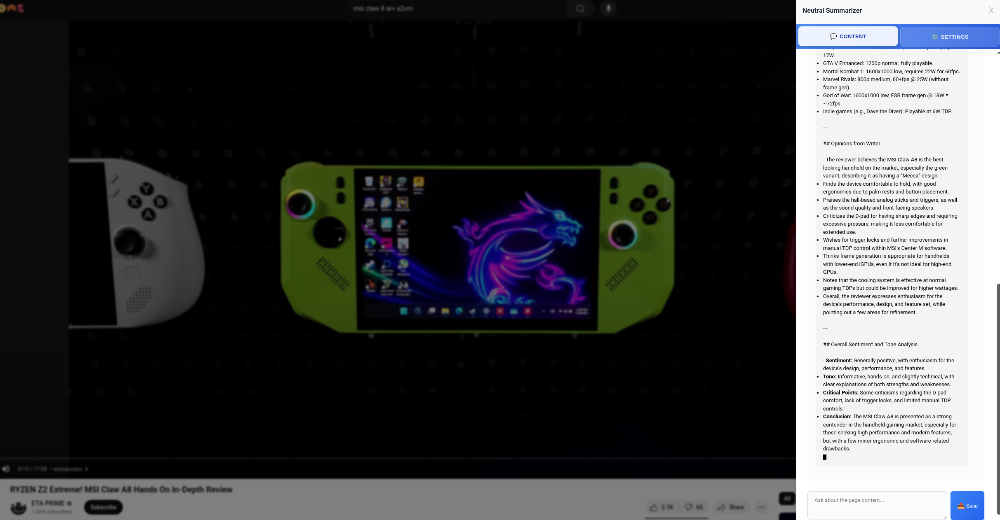
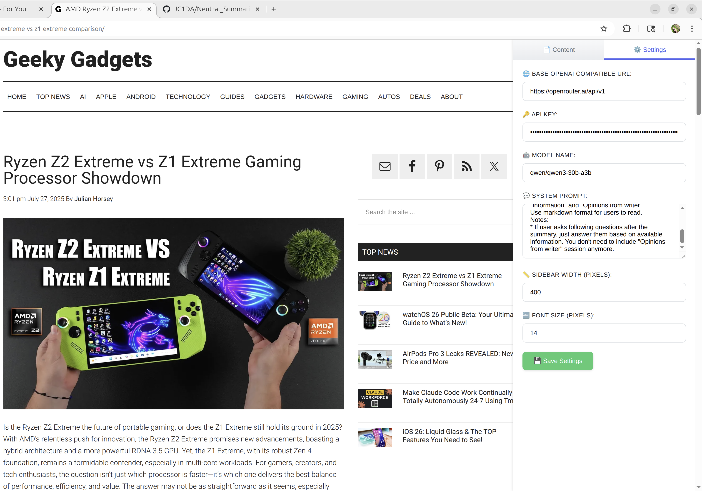

# Neutral Summarizer Chrome Extension

Neutral Summarizer is a Chrome extension that allows you to summarize web pages and chat with an AI about the content. The extension provides a sidebar interface that can be toggled on any webpage. It also includes special support for YouTube videos, allowing you to transcribe and summarize video content.

## Features

1. **Sidebar Interface**: Click the extension icon to open a sidebar on the right side of any webpage
2. **Two Tabs**:
   - **Content Tab**: Summarize the current page and chat with the AI about the content
   - **Settings Tab**: Configure the AI model settings
3. **AI Integration**: Uses OpenAI-compatible APIs for summarization and chat
4. **Streaming Mode**: Real-time updates as the AI generates responses
5. **Persistent Settings**: Saves your API configuration for future use

## Installation

1. Download or clone this repository
2. Open Chrome and navigate to `chrome://extensions`
3. Enable "Developer mode" in the top right corner
4. Click "Load unpacked" and select the `src` directory

## Configuration

In the Settings tab, you can configure:

- **Base OpenAI Compatible URL**: The API endpoint (default: https://openrouter.ai/api/v1)
- **API Key**: Your API key for authentication
- **Model Name**: The AI model to use (default: qwen/qwen3-235b-a22b-2507)
- **System Prompt**: Instructions for the AI on how to summarize content

## Usage

1. Click the Neutral Summarizer icon in your Chrome toolbar
2. Switch to the Content tab and click "Summarize Page" to get a summary
3. Configure your API settings in the Settings tab
4. Use the chat interface to ask questions about the page content

## Examples

Here are some examples of the Neutral Summarizer in action:




## Streaming Mode

The extension uses streaming mode for all API calls to provide real-time updates as the AI generates responses. This means you'll see the AI's response appear gradually in the chat interface, rather than waiting for the entire response to complete. This provides a better user experience as you can start reading the response while it's still being generated.

Benefits of streaming mode:
- Immediate feedback that the AI is processing your request
- Reduced perceived wait time for longer responses
- More natural conversation flow

## Default System Prompt

The extension uses the following default system prompt for summarization:

```
You are a helpful assistant that summarizes web pages. 
Please provide a concise, neutral summary of the content provided. 
Focus on the main points and key information.
Make sure you separate between information and opinions.
Breakdown them in two separated sessions: "Information" and "Opinions from writer"
Use markdown format for users to read.
Notes:
* If user asks following questions after the summary, just answer them based on available information. You don't need to include "Opinions from writer" session anymore.
* Show the most important information first
```

You can customize this prompt in the Settings tab to change how the AI summarizes content.

## Supported APIs

The extension works with any OpenAI-compatible API, including:

- OpenAI
- Local AI models with OpenAI-compatible APIs

## YouTube Transcription Feature

The Neutral Summarizer includes special support for YouTube videos. When you visit a YouTube video page, the extension will automatically add a "Transcribe Video" button below the video title. Clicking this button will:

1. Retrieve the transcription of the YouTube video using the DumplingAI API
2. Automatically summarize the video content in the sidebar
3. Allow you to chat with the AI about the video content

### Configuration

To use the YouTube transcription feature, you need to configure your DumplingAI API key in the Settings tab:

1. Go to the Settings tab in the sidebar
2. Enter your DumplingAI API key in the "DumplingAi API Key" field
3. Save your settings

### How It Works

1. When viewing a YouTube video, a "Transcribe Video" button appears below the video title
2. Click the button to initiate transcription
3. The extension retrieves the video transcript using the DumplingAI API
4. The transcript is then summarized using your configured AI model
5. You can continue to chat with the AI about the video content

Note: The YouTube transcription feature requires an internet connection to access the DumplingAI API.

## Privacy

This extension does not collect or store any personal data. All API requests are made directly from your browser to the configured API endpoint.
