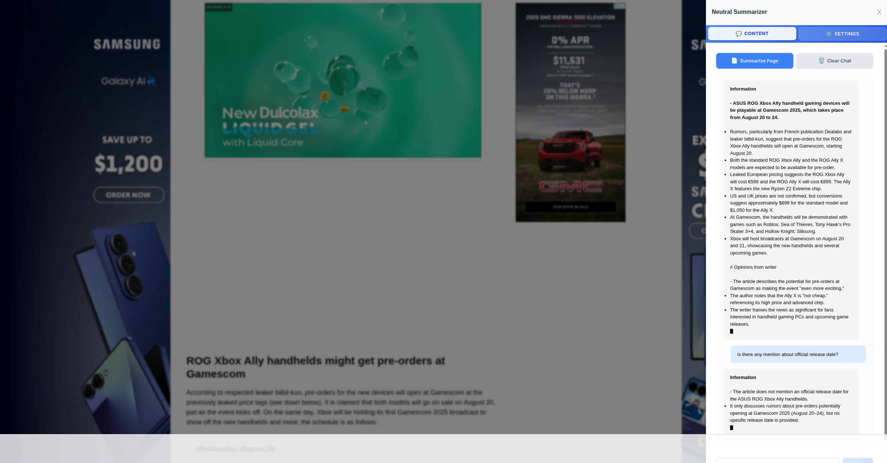

# Neutral Summarizer Chrome Extension

A powerful Chrome extension that leverages AI to provide intelligent summarization and interactive chat capabilities for any web page, with specialized YouTube video analysis using transcript-based AI processing.

## 🖼️ Extension Showcase

Here's what the Neutral Summarizer extension looks like in action:

### Example 1: YouTube Video Analysis

*Extension analyzing a YouTube video with transcript-based AI processing*

### Example 2: Webpage Analysis

*Easy summarization and exploration of any webpage content*

### Example 3: Settings Tab

*Clean, modern sidebar interface*

## ✨ Key Features

### 🚀 Core Functionality
- **Smart Sidebar Interface**: Clean, modern sidebar that slides in smoothly from the right
- **Instant Access**: Click the extension icon to immediately open the sidebar - no secondary popups
- **Tabbed Navigation**: Seamlessly switch between "Content" (chat) and "Settings" tabs
- **Real-time Streaming Responses**: Watch AI responses generate word-by-word with live streaming
- **Markdown Rendering**: Professional formatting with proper markdown support
- **Chat History**: Continue conversations with context-aware AI responses

### 🎬 Advanced YouTube Integration
- **Automatic Detection**: Instantly recognizes YouTube video pages
- **Transcript Retrieval**: Fetches complete video transcripts using DumplingAI API
- **Enhanced Analysis**: AI analyzes both video content and transcript for comprehensive summaries
- **Video Metadata**: Incorporates title, channel, views, likes, and description in analysis

### 🎨 User Experience Enhancements
- **Smart Chat Management**: "Summarize Page" automatically clears previous chat for focused analysis
- **Enhanced Loading States**: Detailed progress messages for YouTube transcript retrieval
- **Smooth Animations**: Elegant transitions and professional UI animations
- **Auto-scrolling**: Chat interface automatically follows streaming content
- **Visual Streaming Indicators**: Blinking cursor and pulse effects during AI response generation

### ⚙️ Advanced Customization
- **Multi-API Support**: Compatible with OpenAI, OpenRouter, and other OpenAI-compatible APIs
- **Flexible Configuration**: Support for multiple AI models and custom endpoints
- **DumplingAI Integration**: Specialized API for YouTube transcript extraction
- **UI Personalization**: Adjustable sidebar width (300-800px) and font size (10-24px)
- **Persistent Settings**: All configurations saved across browser sessions
- **Custom System Prompts**: Tailor AI behavior and output format

## 📦 Installation

### Quick Start Installation

#### Prerequisites
- Google Chrome (version 88 or higher)
- Active API keys for AI services (OpenAI/OpenRouter and DumplingAI)

#### Step-by-Step Installation

1. **Download the Extension**
   - Download the extension files or clone the repository
   ```bash
   git clone https://github.com/JC1DA/Neutral_Summarizer
   cd Neutral_Summarizer
   ```

2. **Enable Developer Mode in Chrome**
   - Open Google Chrome
   - Navigate to `chrome://extensions/`
   - Find the "Developer mode" toggle in the top right corner
   - Click to enable developer mode

3. **Load the Extension**
   - Click the "Load unpacked" button that appears
   - Navigate to and select the `src` directory from the project folder
   - The extension will be installed and appear in your extensions list

4. **Verify Installation**
   - Look for "Neutral Summarizer" in your extensions list
   - Check that the extension icon appears in your Chrome toolbar

5. **Pin to Toolbar** (Recommended)
   - Click the puzzle piece icon (Extensions) in the Chrome toolbar
   - Find "Neutral Summarizer" in the extensions list
   - Click the pin icon next to it to add it to your toolbar for easy access

#### First Launch Setup

1. **Click the Extension Icon**
   - The Neutral Summarizer sidebar will open automatically
   - You'll see tabs for "Content" and "Settings"

2. **Configure API Keys**
   - Go to the "Settings" tab
   - Enter your API keys:
     - **OpenAI/OpenRouter API Key**: For AI summarization and chat
     - **DumplingAI API Key**: For YouTube transcript retrieval
   - Configure other settings as desired (model, prompts, UI preferences)

3. **Test the Extension**
   - Navigate to any web page
   - Click the extension icon
   - Click "Summarize Page" to test functionality

## ⚙️ Configuration

### First-Time Setup

1. **Open the Extension**
   - Click the Neutral Summarizer icon in your Chrome toolbar
   - The sidebar will open automatically

2. **Configure API Settings**
   - Click the "Settings" tab
   - Configure your API endpoints:
     - **Base OpenAI Compatible URL**: Your API endpoint (default: `https://openrouter.ai/api/v1`)
     - **API Key**: Your primary API key for AI services
     - **DumplingAI API Key**: Specialized API key for YouTube transcript extraction
     - **Model Name**: AI model to use (default: `qwen/qwen3-235b-a22b-2507`)
     - **System Prompt**: Customizable AI instructions (pre-configured with optimal defaults)

3. **Customize Appearance**
   - **Sidebar Width**: Adjust between 300-800px using the slider
   - **Font Size**: Adjust between 10-24px using the slider

4. **Save Settings**
   - Click "Save Settings" to persist your configuration
   - Settings automatically restore across browser sessions

## 🚀 Usage Guide

### Basic Web Page Summarization

1. **Navigate to any web page** you want to analyze
2. **Click the Neutral Summarizer icon** in your Chrome toolbar
3. **Click "Summarize Page"** in the Content tab
4. **Watch the streaming response** generate in real-time
5. **Ask follow-up questions** in the chat input

### Advanced YouTube Video Analysis

1. **Navigate to any YouTube video**
2. **Click the Neutral Summarizer icon**
3. **Click "Summarize Page"** - the extension will:
   - **Stage 1**: Show "Retrieving Video Transcript..." while fetching from DumplingAI
   - **Stage 2**: Show "Analyzing page content..." after transcript retrieval
   - Generate comprehensive video analysis using transcript data
4. **Chat about the video** with transcript-aware AI responses

### Interactive Chat Features

- **Real-time Streaming**: AI responses appear word-by-word with visual indicators
- **Smart Chat Management**: "Summarize Page" clears previous chat for focused analysis
- **Markdown Support**: Proper rendering of headers, lists, bold, italic, and code
- **Context Awareness**: AI maintains conversation context throughout the session
- **Auto-scrolling**: Interface automatically follows streaming content

## 🔑 API Requirements

### OpenRouter (Recommended)
1. Create an account at [OpenRouter.ai](https://openrouter.ai)
2. Generate an API key from your dashboard
3. Use base URL: `https://openrouter.ai/api/v1`
4. Benefits: Multiple model support, competitive pricing, streaming support

### OpenAI
1. Create an account at [OpenAI](https://openai.com)
2. Generate an API key from account settings
3. Use base URL: `https://api.openai.com/v1`
4. Note: Ensure your API supports streaming responses

### DumplingAI (YouTube Transcripts)
1. Create an account at [DumplingAI](https://www.dumplingai.com/)
2. Generate API key for YouTube transcript service
3. Required for YouTube video analysis features
4. Provides accurate, timestamped video transcripts

## 🛠️ Troubleshooting

### Common Issues & Solutions

#### Extension Won't Load
- Ensure Chrome version 88 or higher
- Verify "Developer mode" is enabled in `chrome://extensions/`
- Check you selected the correct `src` directory

#### Streaming Responses Not Working
- Verify your API provider supports streaming (`stream: true`)
- Check network connection and API key validity
- Ensure API endpoint supports Server-Sent Events (SSE)

#### YouTube Features Not Working
- Confirm DumplingAI API key is valid and has credits
- Verify YouTube video has available captions/transcripts
- Check video is publicly accessible (not private or restricted)

#### Transcript Retrieval Errors
- Ensure "Retrieving Video Transcript..." message appears
- Check DumplingAI API service status
- Verify video ID is correctly extracted from URL

#### Performance Issues
- For long pages, content is automatically truncated to 16000 characters
- YouTube transcript retrieval may take 2-5 seconds depending on video length
- Streaming responses provide immediate feedback even for long content

## 🔒 Security & Privacy

### Data Protection
- **Zero Data Collection**: No personal data or usage analytics collected
- **Local Storage Only**: Settings stored securely in browser's local storage
- **Direct API Communication**: No intermediaries between extension and your APIs
- **Temporary Processing**: Content processed only during active sessions

### API Key Security
- **Encrypted Storage**: API keys stored using Chrome's secure storage API
- **Limited Transmission**: Keys sent only to your configured API endpoints
- **No Third Parties**: Keys never shared with any external services except your APIs
- **User Control**: Complete control over API key management

### Content Processing
- **Client-Side Extraction**: Web content processed locally before API calls
- **Minimal Data Transfer**: Only essential content sent to AI services
- **No Persistent Storage**: Processed content never stored permanently
- **Transparent Processing**: Users can see exactly what data is being processed

## 🏗️ Development

### Project Architecture

```
src/
├── manifest.json                 # Chrome extension manifest
├── background.js                 # Background service worker (API calls)
├── content.js                    # Content script (UI, streaming, logic)
├── popup/
│   ├── popup.html               # Extension popup
│   └── popup.js                 # Popup logic
├── sidebar/
│   ├── components/
│   │   ├── chat-component.js    # Chat interface with streaming
│   │   ├── settings-component.js # Settings management
│   │   └── markdown-renderer.js # Markdown formatting
├── utils/
│   ├── api-client.js            # OpenAI/DumplingAI API clients
│   ├── content-extractor.js     # Web content extraction
│   ├── storage-manager.js       # Chrome storage utilities
│   └── youtube-detector.js      # YouTube page detection
└── assets/
    ├── icons/                   # Extension icons
    └── lib/
        └── marked.min.js        # Markdown parser
```

## 📄 License

This project is licensed under the MIT License. See [LICENSE](LICENSE) for details.

## 🚀 Future Enhancements

### Planned Features
- [ ] Dark mode toggle
- [ ] Keyboard shortcuts

---

**Built with ❤️ using Vibe-Coding**

> **Note**: This extension requires active API keys for full functionality.
